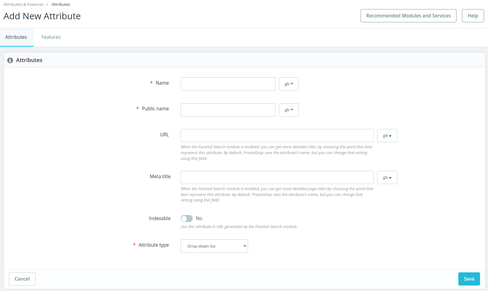

# Edit / Add attribute page

## Description

This page allow to edit or add a product attribute

[QA test](https://build.prestashop.com/test-scenarios/scenarios/core/functional/bo/catalog/attributes-and-features/attributes.html)

## Components description

### Attributes / Features tab

Allow to switch from attributes list to features list. [See call to action](page-template-1.md#attributes-features-tab-call-to-action)

### Name

| Description      | Value                                                               | Error message                                                  |                                   |
| ---------------- | ------------------------------------------------------------------- | -------------------------------------------------------------- | :-------------------------------: |
| Mandatory        | YES                                                                 | Tht e field name is required at  least in "_default language_” |    Error message if not allowed   |
| Forbidden values | <>;=#{}”                                                            | The name field is invalid.                                     |                                   |
| Default value    | -                                                                   | -                                                              |                                   |
| Help text        | Help text                                                           | -                                                              |                                   |
| Tool tips        | Your internal name for this attribute. Invalid characters <>;=#{}”  | -                                                              |                                   |
| Lower limit      |                                                                     |                                                                | Error message if bellow the limit |
| Upper limit      |                                                                     |                                                                |  Error message if up to the limit |
| Behavior         | [link to the behavior](page-template-1.md#behaviors-description)    | -                                                              |                                   |

### A component description

Several cases

1. The component is a common UI / UX (for example "Help button"): It MUST be a link to this [common components](../../../../../common-components.md)
2. The component is a common component with a standard behavior described in the [UI/KIT](https://build.prestashop.com/prestashop-ui-kit/?path=/story/modals--modal) or Design System : it must be a link to the UI/KIT or DS
3. Otherwise the component MUST be described as a Table as described bellow

| Description              | Value                                                            | Error message |                                   |
| ------------------------ | ---------------------------------------------------------------- | ------------- | :-------------------------------: |
| Mandatory                | YES/NO                                                           | -             |    Error message if not allowed   |
| Allowed/Forbidden values |                                                                  |               |                                   |
| Default value            | Default value                                                    | -             |                                   |
| Help text                | Help text                                                        | -             |                                   |
| Tool tips                | Tool tips text                                                   | -             |                                   |
| Lower limit              |                                                                  |               | Error message if bellow the limit |
| Upper limit              |                                                                  |               |  Error message if up to the limit |
| Behavior                 | [link to the behavior](page-template-1.md#behaviors-description) | -             |                                   |

This section COULD contains label (ex: multishop  ...)

## Behaviors description

This section MUST contains :

* A section with the whole picture of the behaviors and worfkow
* For each behavior, a sub section that describes it

### Workflow

This sub-section MUST describe the page workflow

This sub-section MUST include a diagram of this worflow (using : [https://app.diagrams.net/](https://app.diagrams.net) or [figma](https://www.figma.com/file/14ptOoCqDdmBqtmq1Grc5M/BO-Core-Cartography?node-id=0%3A1) ) & the xml export of this workflow

### Behavior description

* This sub-section MUST contains the description of the behavior / call to action.
* This sub-section COULD contains a link to the relevant [business rule](../../../../../../how-to-write-functional-documentation/templates/business-rules-template.md)

This section COULD contains label (ex: multishop case ...)

## Error messages

This section MUST list all errors messages / Exceptions for the page / workflow

## Limitations

This section SHOULD list limitations of the page.
