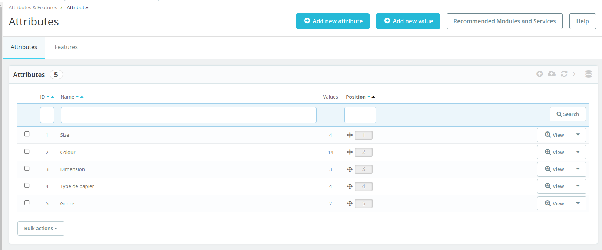

# Attributes List page

## Description

This section MUST describe the page shortly

It MUST include

* [A link to related tests](https://build.prestashop.com/test-scenarios/scenarios/core/functional/bo/catalog/attributes-and-features/attributes.html)

This section COULD include other screenshots of the page depending of the configuration (ex: B2B, Multistore ). Those screenshots MUST be labelled (ex : B2B ) for further uses ( see below)

The screenshot COULD include some labels or numbers to some UI component if needed. So you can refer to this "label" bellow.

## Components description

This section MUST describe each component one by one

### Add new attribute button

To add a new attribute

Call to action : [Add new attribute behavior](page-template.md#add-new-attribute-call-to-action)

### Add new value button

To add new value

Call to action : [Add new value behavior](page-template.md#add-new-value)

### Help  button

See [Help button](../../../../../common-components/help-button.md) ( common components)&#x20;

### Attributes / Features tab

Allow to switch from attibutes list to features list. [See call to action](page-template.md#attributes-features-tab-behavior)

### Attributes label (number)

Display Attributes (_number of attributes_)&#x20;

### Setting wheels

See[ settings wheel ](../../../../../common-components/settings-wheel.md)(common component)

### Bulk Actions

Clicking on the _Bulk actions_ button allows performing bulk actions for the selected attributes (using the checkboxes). A user can:

* [Select all](page-template.md#bulk-action-select-all)&#x20;
* [Unselect all](page-template.md#bulk-action-unselect-all)
* [Delete selected](page-template.md#bulk-action-delete-selected)

### Label & ordering columns

| Label    | Order by                                                   |
| -------- | ---------------------------------------------------------- |
| id       | index ( int )                                              |
| Name     | name (chars)                                               |
| Value    | N/A                                                        |
| Position | position index. Note : the ascendent ording display ...... |

The column can be sort ascending & descending

### Filters

#### ID

|                    |                                                                      |   |
| ------------------ | -------------------------------------------------------------------- | - |
| Allowed characters | all                                                                  |   |
| Default value      |                                                                      |   |
| Help text          |                                                                      |   |
| Tool tips          |                                                                      |   |
| Lower limit        |                                                                      |   |
| Upper limit        |                                                                      |   |
| Behavior           | [link to the behavior](page-template.md#one-component-description-1) |   |

#### Name

| Allowed characters | all                                                                  |   |
| ------------------ | -------------------------------------------------------------------- | - |
| Default value      |                                                                      |   |
| Help text          |                                                                      |   |
| Tool tips          |                                                                      |   |
| Lower limit        |                                                                      |   |
| Upper limit        |                                                                      |   |
| Behavior           | [link to the behavior](page-template.md#one-component-description-1) |   |

#### Name

| Allowed characters | all                                                                  |   |
| ------------------ | -------------------------------------------------------------------- | - |
| Default value      |                                                                      |   |
| Help text          |                                                                      |   |
| Tool tips          |                                                                      |   |
| Lower limit        |                                                                      |   |
| Upper limit        |                                                                      |   |
| Behavior           | [link to the behavior](page-template.md#one-component-description-1) |   |

### Columns

1. ID: the attribute ID&#x20;
2. Name : the attribute name
3. Values: It indicates the number of values for the attribute.
4. Position : The position of each attribute can be changed by clicking on this column and by moving it up or down. After changing the position, the message “Successful update.” is displayed.
5.  Actions :&#x20;

    &#x20;View the attribute\
    &#x20;[Edit](page-template.md#add-new-attribute-button) \
    [ Delete](page-template.md#bulk-action-delete-selected)

****

****

\

##

## Behaviors description

This section MUST contains :

* A section with the whole picture of the behaviors and worfkow
* For each behavior, a sub section that describes it

### Workflow

This sub-section MUST describe the page workflow

This sub-section MUST include a diagram of this worflow (using : [https://app.diagrams.net/](https://app.diagrams.net) ) & the xml export of this workflow

### Add new attribute call to action

Call to action : [Edit / Add attribute page](edit-add-attribute-page.md)

### Add new value call to action

Call to action : [Edit / Add value page](edit-add-new-value.md)

### Attributes / Features tab call to action

call to action Attributes : [reload this page](page-template.md) . It unselects the list

call to action Features : [Features list page](../features/features-list-page.md) &#x20;

### Select all call to action

Select all attributes into the list

### Unselect all call to action

Unselect all attributes into the list

### Delete selected call to action

This action will delete the selected attributes.&#x20;

After clicking on “Delete selected”, a modal with the title “Delete selection” is opened asking to confirm or cancel the action: “Are you sure you want to delete the selected item(s)?” (See issue [#14462](https://github.com/PrestaShop/PrestaShop/issues/14462)). The action can be canceled by clicking on the cross or on the cancel button. After clicking on “Delete” button, the selected attributes and all their values are deleted, a successful message is displayed “The selection has been successfully deleted.”

See Business rules : delete attributes\

### View call to action

Call to action : [View attribute page](view-attrribute-page.md)

This sub-section COULD contains a link to the relevant [business rule](../../../../../../../functionnal-documentation/how-to-write-functional-documentation/templates/broken-reference/)

This section COULD contains label (ex: multishop case ...)

## Error messages

This section MUST list all errors messages / Exceptions for the page / workflow

## Limitations

This section SHOULD list limitations of the page.
