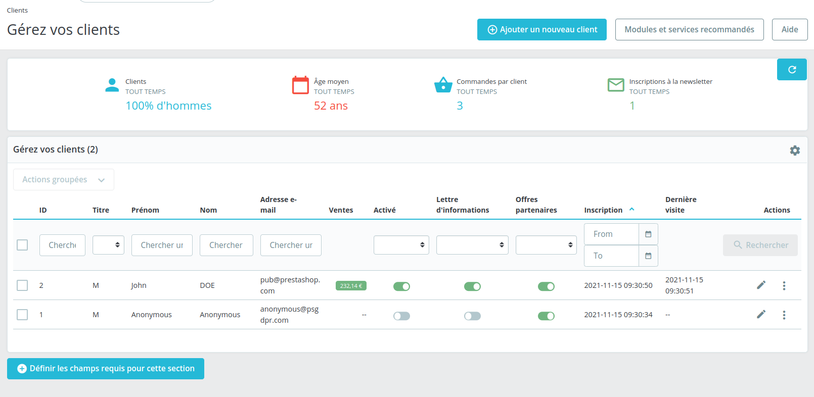

# Orders (list)

## Description

This section MUST describe the page shortly

It MUST include

* [A link to related tests](https://build.prestashop.com/test-scenarios/)

This section MUST include a screenshot of the Page

This section COULD include other screenshots of the page depending of the configuration (ex: B2B, Multistore ). Those screenshots MUST be labelled (ex : B2B ) for further uses ( see below)

The screenshot COULD include some labels or numbers to some UI component if needed. So you can refer to this "label" bellow.

## Components description

This section MUST describe each component one by one

### A component description

Several cases

1. The component is a common UI / UX (for example "Help button"): It MUST be a link to this [common components](../../../common-components.md)
2. The component is a common component with a standard behavior described in the UI/KIT or Design System : it must be a link to the UI/KIT or DS
3. Otherwise the component MUST be described as a Table as described bellow

|                    |                                                                      |                                   |
| ------------------ | -------------------------------------------------------------------- | --------------------------------- |
| Allowed characters |                                                                      | Error message if not allowed      |
| Default value      | Default value                                                        |                                   |
| Help text          | Help text                                                            |                                   |
| Tool tips          | Tool tips text                                                       |                                   |
| Lower limit        |                                                                      | Error message if bellow the limit |
| Upper limit        |                                                                      | Error message if up to the limit  |
| Behavior           | [link to the behavior](page-template.md#one-component-description-1) |                                   |

This section COULD contains label (ex: multishop case ...)

## Behaviors description

This section MUST contains :

* A section with the whole picture of the behaviors and worfkow
* For each behavior, a sub section that describes it

### Workflow

This sub-section MUST describe the page workflow

This sub-section MUST include a diagram of this worflow (using : [https://app.diagrams.net/](https://app.diagrams.net) ) & the xml export of this workflow

### Behavior description

* This sub-section MUST contains the description of the behavoir / call to action.
* This sub-section COULD contains a link to the relevant [business rule](../../../../../readme/ux-ui/back-office/orders/broken-reference/)

This section COULD contains label (ex: multishop case ...)

## Error messages

This section MUST list all errors messages / Exceptions for the page / workflow

## Limitations

This section SHOULD list limitations of the page.
